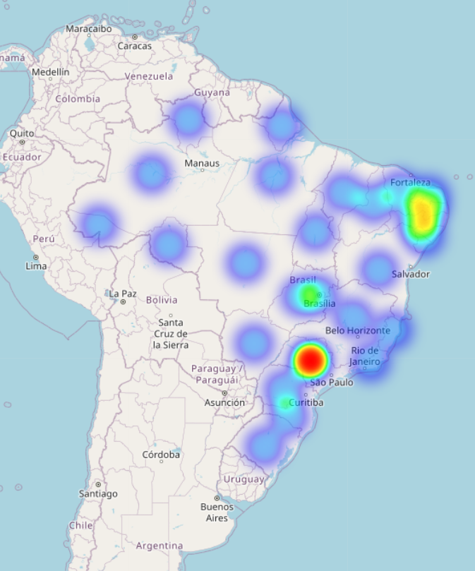
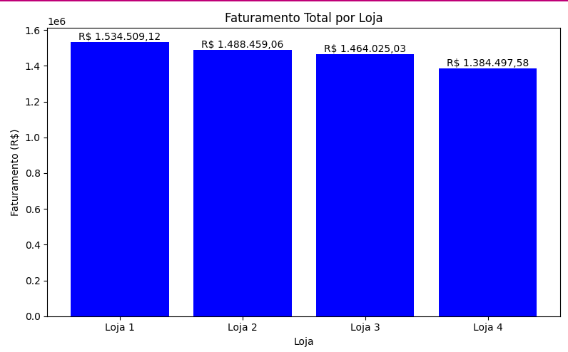
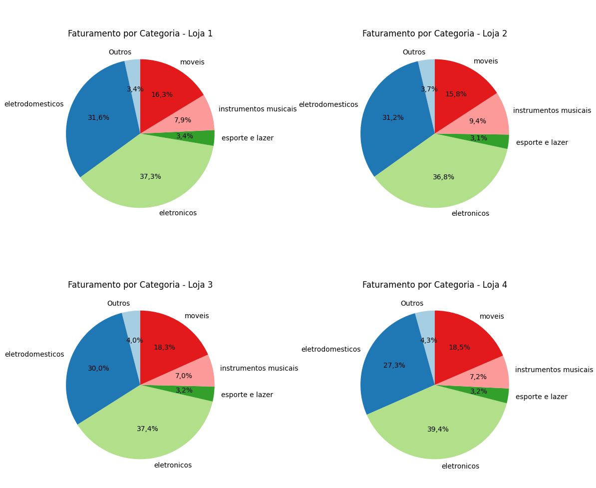
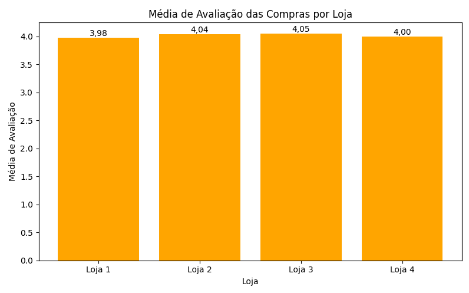

# Relatório Final

## Relatório Comparativo com os Principais Indicadores

| Loja   | Total de Vendas | Faturamento Total (R$) | Média de Preço (R$) | Média do Frete (R$) | Nota Média de Avaliação |
|--------|-----------------|------------------------|----------------------|---------------------|-------------------------|
| Loja 1 | 2359            | 1.534.509,12          | 650,49              | 34,69               | 3,98                   |
| Loja 2 | 2359            | 1.488.459,06          | 630,97              | 33,62               | 4,04                   |
| Loja 3 | 2359            | 1.464.025,03          | 620,61              | 33,07               | 4,05                   |
| Loja 4 | 2358            | 1.384.497,58          | 587,15              | 31,28               | 4,00                   |

## Conclusão: Loja que Deve Ser Fechada

A **Loja 4** apresenta os piores resultados financeiros:

- Menor faturamento total.
- Menor preço médio.
- Menor volume de vendas (mesmo que por apenas 1 venda).
- Avaliação média inferior à da Loja 3 e Loja 2.

Apesar de ter o frete mais barato e uma nota razoável, o desempenho comercial da Loja 4 é o mais fraco.

## Mapa de Calor

O **Mapa de Calor** apresenta a concentração de vendas com base nas coordenadas geográficas (latitude e longitude) dos dados de vendas. Ele ajuda a identificar as regiões com maior volume de vendas.

### Visualização do Mapa de Calor
Abaixo está uma prévia do mapa de calor gerado:



### Análise
- As áreas mais escuras no mapa representam regiões com maior concentração de vendas.
- Este mapa pode ser usado para identificar mercados-alvo e planejar estratégias de marketing ou logística.

Para visualizar o mapa interativo completo, abra o arquivo `mapa_calor.html` no navegador.


# Alura Store - Análise de Vendas

Este projeto realiza a análise de vendas de quatro lojas fictícias, utilizando dados em arquivos CSV. O objetivo é comparar o desempenho das lojas, analisar o faturamento por categoria de produto e apresentar visualizações gráficas para facilitar a tomada de decisão.

## Estrutura do Projeto

- `loja_1.csv`, `loja_2.csv`, `loja_3.csv`, `loja_4.csv`: Arquivos de dados de vendas de cada loja.
- `AluraStoreBr.ipynb`: Notebook principal para análise exploratória, cálculos e visualizações usando pandas e matplotlib.
- `faturamento.py`: Script para calcular e visualizar o faturamento total de cada loja, utilizando listas por compreensão e visualização gráfica.
- `produtos.py`: Script para calcular o faturamento por categoria de produto em cada loja, gerar tabelas e gráficos de pizza, utilizando pandas e listas.
- `avaliacao.py`: Script para calcular a média de avaliação das compras por loja e gerar gráficos de barras.
- `rascunho.py`: Script auxiliar para testes, cálculos diversos e experimentação de médias, somas e gráficos.

## Principais Funcionalidades

- **Cálculo do faturamento total por loja** com listas por compreensão e visualização em gráfico de barras.

## Faturamento Total por Loja

O gráfico abaixo apresenta o **faturamento total** de cada loja, permitindo uma comparação clara entre elas:



### Análise
- O gráfico de barras mostra o faturamento total de cada loja.
- É possível identificar qual loja teve o maior e o menor faturamento.
- Este gráfico é útil para avaliar o desempenho financeiro de cada unidade.

- **Cálculo do faturamento por categoria de produto** para cada loja, com apresentação em tabela e gráficos de pizza.

## Faturamento por Categoria de Produto

O gráfico abaixo apresenta o **faturamento por categoria de produto** para cada loja, permitindo uma análise detalhada das categorias que mais contribuem para o faturamento:



### Análise
- O gráfico de pizza mostra a participação percentual de cada categoria no faturamento total.
- É possível identificar quais categorias têm maior impacto no faturamento de cada loja.
- Este gráfico é útil para entender quais produtos são mais relevantes para o desempenho financeiro.

- **Cálculo da média de avaliação das compras** por loja, com visualização em gráfico de barras.

## Média de Avaliação das Compras por Loja

O gráfico abaixo apresenta a **média de avaliação das compras** realizadas em cada loja, permitindo uma análise da satisfação dos clientes:



### Análise
- O gráfico de barras mostra a média de avaliação das compras por loja.
- É possível identificar quais lojas possuem maior ou menor satisfação dos clientes.
- Este gráfico é útil para avaliar a qualidade do atendimento e dos produtos oferecidos.

- **Comparação entre lojas** de forma visual e tabular.
- **Visualização dos dados em gráficos de barras e pizza** com matplotlib.
- **Formatação dos valores em reais (R$)**.
- **Uso avançado de listas e pandas** para tornar o código mais eficiente, compacto e legível.

## Como Executar

1. **Clone o repositório e acesse a pasta do projeto:**
   ```bash
   git clone https://github.com/coliveira1977/alura_store
   cd alura_store
   ```

2. **Instale as dependências necessárias:**
   ```bash
   pip install pandas matplotlib
   ```

3. **Execute os scripts Python conforme desejado:**
   - Para ver o faturamento total das lojas:
     ```bash
     python faturamento.py
     ```
   - Para ver o faturamento por categoria e gráficos de pizza:
     ```bash
     python produtos.py
     ```
   - Para ver a média de avaliação das compras por loja:
     ```bash
     python avaliacao.py
     ```
   - Para testar médias, somas e gráficos diversos:
     ```bash
     python rascunho.py
     ```

4. **Ou abra o notebook no Jupyter:**
   ```bash
   jupyter notebook AluraStoreBr.ipynb
   ```

## Exemplos de Visualizações

- Gráfico de barras comparando o faturamento total das lojas.
- Gráficos de pizza mostrando a participação percentual de cada categoria de produto no faturamento de cada loja.
- Tabelas formatadas com valores em reais.

## Sobre os Dados

Cada arquivo CSV contém as seguintes colunas:
- Produto
- Categoria do Produto
- Preço
- Frete
- Data da Compra
- Vendedor
- Local da compra
- Avaliação da compra
- Tipo de pagamento
- Quantidade de parcelas
- lat
- lon

## Licença

Este projeto é apenas para fins educacionais.

---

Desenvolvido para o Challenge de Data Science da Alura.
